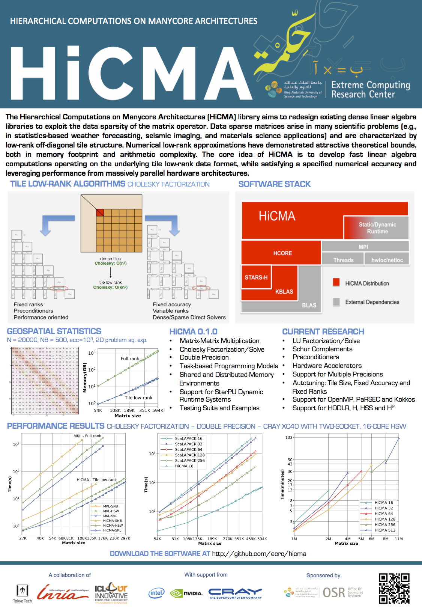

HiCMA: Hierarchical Computations on Manycore Architectures
===========================================================
The **Hierarchical Computations on Manycore Architectures (HiCMA)** library aims to redesign existing 
dense linear algebra libraries to exploit the data sparsity of the matrix operator. Data sparse 
matrices arise in many scientific problems (e.g., in statistics-based weather forecasting, seismic 
imaging, and materials science applications) and are characterized by low-rank off-diagonal tile 
structure. Numerical low-rank approximations have demonstrated attractive theoretical bounds, both in 
memory footprint and arithmetic complexity. The core idea of HiCMA is to develop fast linear algebra 
computations operating on the underlying tile low-rank data format, while satisfying a specified 
numerical accuracy and leveraging performance from massively parallel hardware architectures. 

Features of HiCMA 1.0.0
-----------------------------
* Matrix-Matrix Multiplication
* Cholesky Factorization/Solve
* Double Precision
* Task-based Programming Models
* Shared and Distributed-Memory Environments
* Support for StarPU Dynamic Runtime Systems
* Testing Suite and Examples
* Support for 3D unstructured mesh deformation of a population of the novel coronaviruses (i.e., SARS-CoV-2)
* LU factorization (hicma_zgetrf) on double complex matrices stored in tile low-rank (TLR) format. 

Current Research
----------------
* Matrix Inversion
* Schur Complements
* Preconditioners
* Hardware Accelerators
* Support for Multiple Precisions
* Autotuning: Tile Size, Fixed Accuracy and Fixed Ranks
* Support for OpenMP, PaRSEC and Kokkos
* Support for HODLR, H, HSS and H2 

External Dependencies
---------------------
HiCMA depends on the following libraries:
* Chameleon
* HCORE
* STARS-H
* hwloc
* StarPU
* MPI

Installation
------------

Please see INSTALL.md for information about installing and testing.

Dataset
------------

Please see Data.md for information about dataset.

References
-----------
1. K. Akbudak, H. Ltaief, A. Mikhalev, and D. E. Keyes, *Tile Low Rank Cholesky Factorization for 
Climate/Weather Modeling Applications on Manycore Architectures*, **International Supercomputing 
Conference (ISC17)**, June 18-22, 2017, Frankfurt, Germany.

2. K. Akbudak, H. Ltaief, A. Mikhalev, A. Charara, and D. E. Keyes, *Exploiting Data Sparsity for Large-Scale Matrix Computations*, **Euro-Par 2018**, August 27-31, 2018, Turin, Italy.

3. Q. Cao, Y. Pei, T. Herault, K. Akbudak, A. Mikhalev, G. Bosilca, H. Ltaief, D. E. Keyes, and J. Dongarra, *Performance Analysis of Tile Low-Rank Cholesky Factorization Using PaRSEC Instrumentation Tools*, **2019 IEEE/ACM International Workshop on Programming and Performance Visualization Tools (ProTools)**, Denver, CO, USA, 2019, pp. 25-32.

4. Q. Cao, Y. Pei, K. Akbudak, A. Mikhalev, G. Bosilca, H. Ltaief, D. E. Keyes, and J. Dongarra, *Extreme-Scale Task-Based Cholesky Factorization Toward Climate and Weather Prediction Applications*, **The Platform for Advanced Scientific Computing (PASC 2020)**.

5. N. Al-Harthi, R. Alomairy, K. Akbudak, R. Chen, H. Ltaief, H. Bagci, and D. E. Keyes, *Solving Acoustic Boundary Integral Equations Using High Performance Tile Low-Rank LU Factorization*, **International Supercomputing Conference (ISC 2020)**. [GCS Award Winning Paper at ISC2020](https://www.gauss-centre.eu/news/newsflashes/article/gcs-award-2020-1/)

